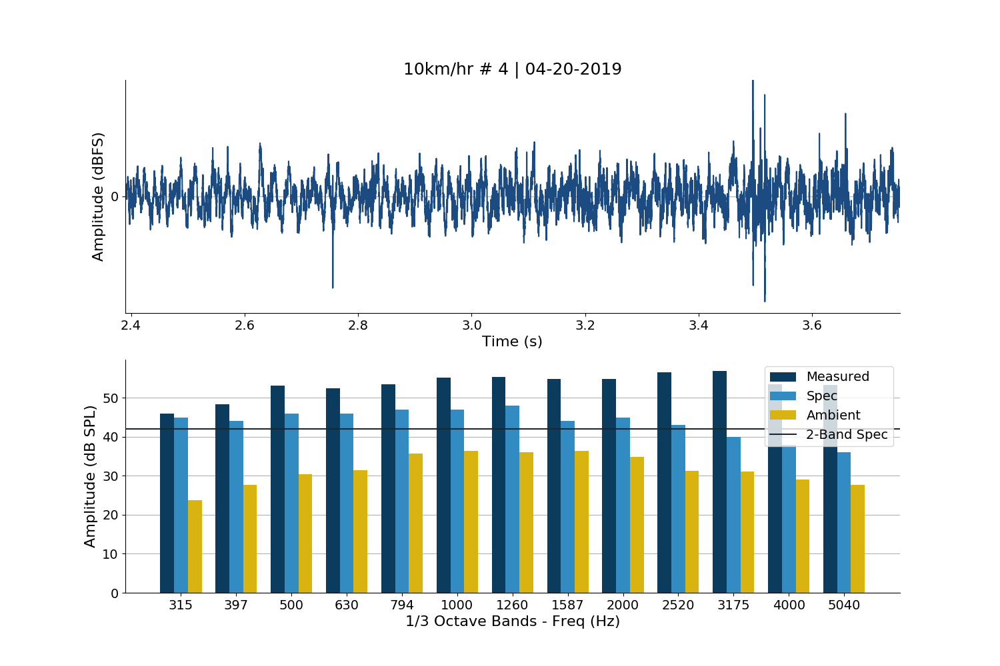

# ev-sound-analysis
Analyzing audio from electric vehicles to determine FMVSS 141 compliance

## Overview
This code provides a method for testing the compliance of electric vehicles (EVs) using readily available audio equipment. Traditional methods for conducting acoustic tests of these kind often require expensive hardware far outside the price range of consumers and university researchers. In addition, proprietary software is often required to implement the acoustic analysis (1/3 octave band analysis) specified in this kind of acoustic test. This code serves to offer an alternative process with comparable results, although with a greater margin of error due to difficulties in calibration. 


Demonstration of EV testing setup. This features a reference condenser microphone ([Behringer ECM8000](https://www.amazon.com/dp/B000HT4RSA)), a USB audio interface ([Focusrite Scarlett Solo](https://www.amazon.com/dp/B01E6T56CM)), and a consumer laptop running a DAW for audio recording ([Adobe Audition](https://www.adobe.com/products/audition.html)).


Example output plot showing measured A weighted dB SPL values for the 10 km/hr test case, as well as ambient noise and the FMVSS 141 specification.

## Testing procedure
A specific testing procedure must be carried out to ensure as accurate results as possible. For full details on the test setup for FMVSS 141 compliance, please see the specification. 

Required hardware is as follows:
* Reference microphone
* Audio interface (24-bit 48 kHz recording)
* Audio recording software

And the calibration and test steps are:
1. Place the reference microphone in the testing position.
2. Play a consistent sound (e.g. white noise) for calibration.
3. Use a calibrated A weighted dB SPL meter to measure the level.
4. Note this value and use it in the name of the calibration file. (`cal_74_04-21-2019.wav` for 74 dB SPL)
5. Record about 5-10 seconds of this sound from the reference microphone.
6. Record about 5-10 seconds of the ambient sound in the testing environment. (`amb_04-21-2019.wav`)
7. Finally conduct each test recording at least 2 seconds of audio. (`stat_04-21-2019_1.wav`)

The final number of the test file indicates which run of that kind of test the audio recording corresponds to. This allows the user to provide and plot multiple runs of the same kind of test in the same directory. 

Use the proper filename format for each testing type for proper plotting.

| Test type  | Filename example        | 
| ---------- | ----------------------- | 
| Stationary | `stat_04-21-2019_1.wav` |
| Reverse    | `rev_04-21-2019_1.wav`  |
| 10 km/hr   | `10_04-21-2019_1.wav`   |
| 20 km/hr   | `20_04-21-2019_1.wav`   |
| 30 km/hr   | `30_04-21-2019_1.wav`   |
| Ambient    | `amb_04-21-2019.wav`    |
| Calibration| `cal_74_04-21-2019.wav` |

Store all test files in a single directory and install and run the code as shown below to create plots for each of the test cases. Note: the provided directory MUST contain a calibration and ambient audio file in order to produce any kind of plot. The number of test files in a single directory can be arbitrary as long as a number (run index) is provided for each test file, as explained above.

## Setup and Usage

Clone this repository.

```
git clone https://github.com/csteinmetz1/ev-sound-analysis
```

Install python requirements.

```
pip install -r requirements.txt
```

Run analysis on your audio file or files.

```
python scripts/evsa.py input_directory -o output_directory
```

Note: This code is written for Python 3.7 or greater. Compatibility is not ensured for any other versions.

## Background
A new regulation from the National Highway Traffic Safety Administration has been enacted that requires all electric vehicles meet given sound output requirements when operating in different scenarios. This was due to concerns that the low sound output of many electric vehicles can make them hazardous to pedestrians. The regulation provides target sound pressure levels (A weighted) over the frequency range for a number of different operating conditions of the vehicles (stationary, reverse, forward motion, etc.). Full details of the specification are presented in the document below.

[Federal Motor Vehicle Safety Standard No. 141, Minimum Sound Requirements for Hybrid and Electric Vehicles](https://www.federalregister.gov/documents/2018/02/26/2018-03721/federal-motor-vehicle-safety-standard-no-141-minimum-sound-requirements-for-hybrid-and-electric)

## Resources 
* [1/3 octave band analysis by FFT](http://www.mstarlabs.com/docs/tn257.html)
* [Third-Octave Analysis Toolkit](http://www.ni.com/pdf/manuals/320952a.pdf)
* [A weighting filter](https://gist.github.com/endolith/148112) by [endolith](https://github.com/endolith)